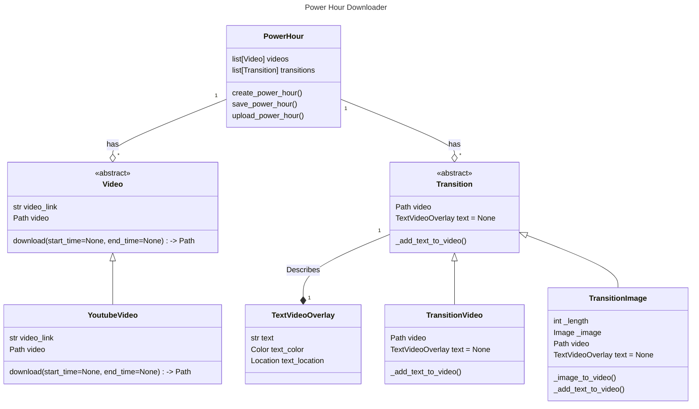

```mermaid
---
title: Power Hour Downloader
---
%% The details of mermaid classDiagram are found here: https://mermaid.js.org/syntax/classDiagram.html
classDiagram
    PowerHour "1" --o "*" Video: has
    PowerHour "1" --o "*" Transition: has
    class PowerHour {
        list[Video] videos
        list[Transition] transitions

        create_power_hour()
        save_power_hour()
        upload_power_hour()
    }

    class TextVideoOverlay {
        str text
        %% TODO how will i represent color
        Color text_color
        %% TODO how will i represent location?
        Location text_location
    }

    %% TODO 1 to 0..1
    Transition "1" --* "1" TextVideoOverlay : Describes
    class Transition {
        <<abstract>>
        Path video
        TextVideoOverlay text = None

        _add_text_to_video()
    }

    Transition <|-- TransitionVideo
    class TransitionVideo {
        Path video
        TextVideoOverlay text = None

        _add_text_to_video()
    }

    Transition <|-- TransitionImage
    class TransitionImage {
        int _length
        Image _image
        Path video
        TextVideoOverlay text = None

        _image_to_video()
        _add_text_to_video()
    }

    class Video{
        <<abstract>>
        %% TODO should str be a link class?
        str video_link
        Path video

        download(start_time=None, end_time=None) -> Path
    }

    Video <|-- YoutubeVideo
    class YoutubeVideo {
        %% TODO should str be a link class?
        str video_link
        Path video

        download(start_time=None, end_time=None) -> Path
    }

%%
%%    class Game {
%%        str game_type
%%        Players players
%%        Deck deck
%%        ScoreCard score_card
%%        GameRules game_rules
%%        Player Dealer
%%
%%        run_game()
%%        start_round()
%%        get_player_move()
%%        execute_player_move()
%%        end_round()
%%        _record_scores()
%%    }
%%
%%    %% base _get_decks on number of players
%%    Game "1" --o "1" GameRules : has
%%    class GameRules {
%%        <<abstract>>
%%        int num_decks
%%
%%        _get_num_decks()
%%
%%    }
%%
%%    %% TODO better way to get round
%%    %% TODO better relationship here
%%    Game "1" --o "1" ScoreCard : has
%%    class ScoreCard {
%%        dict Player: Score
%%
%%        get_score(Player player, int round)
%%        get_ordered_score()
%%    }
%%
%%    %% A Score is linked to a plaer through the ScoreCard need to have that relationship come through
%%    Player "1" --o "1" Score : has
%%    ScoreCard "1" --o "*" Score : has
%%    class Score {
%%        list[int] scores
%%        int total
%%    }
%%
%%    GameRules <-- itRules
%%    class itRules {
%%        list[Turn] turns
%%        list[Card] wild_cards
%%
%%        is_wild_card()
%%    }
%%
%%    itRules -- Turn
%%    class Turn {
%%        tuple[Meld] hand
%%        discard_allowed
%%    }
%%
%%    %% According to wikipedia a meld in rummy is a book or a run
%%    Meld -- itRules
%%    class Meld {
%%        <<abstract>>
%%
%%    }
%%
%%    Meld <-- Book
%%    class Book {
%%        is_book(list[Card] cards)
%%    }
%%
%%    Meld <-- Run
%%    class Run {
%%        is_run(list[Card] cards)
%%    }
%%
%%    Game -- Players
%%    class Players {
%%        list[Player] players
%%    }
%%
%%    %% TODO some of these functions are part of itrules maybe we need an itplayer
%%    %% TODO shouold can_lay_down be controlled by the Game not by the player?
%%    Players -- Player
%%    class Player {
%%        Hand hand
%%        str name
%%        ??? avatar
%%        bool isDealer
%%
%%        _get_all_books()
%%        _get_all_runs()
%%        can_lay_down()
%%        lay_down()
%%        request_card()
%%        draw_card_from_deck()
%%        draw_card_from_discard()
%%        end_turn()
%%    }
%%
%%    Player -- Hand
%%    Card -- Hand
%%    class Hand {
%%        list[card] cards
%%        int value
%%
%%        get_all_runs()
%%        get_all_books()
%%    }
%%
%%    Game -- Deck
%%    class Deck {
%%        list[Card] cards
%%
%%        create_deck(int num_decks)
%%        shuffle()
%%    }
%%
%%    %% identifier is used to uniquley identify the card
%%    %% TODO left off here addd in things like this: Student "1" --o "1" IdCard : carries
%%    Deck -- Card
%%    class Card {
%%        enum suit
%%        enum rank
%%        int points
%%        ??? identifier
%%    }
%%
%%    %% plays avaliable should get the avaliable plays avaliable on the board for the current game. This will be used by the player when determining if they can play
%%    %% TODO this is mainly the gui so we arent going to do anything here
%%    class Board {
%%        plays_avaliable()
%%    }
```
