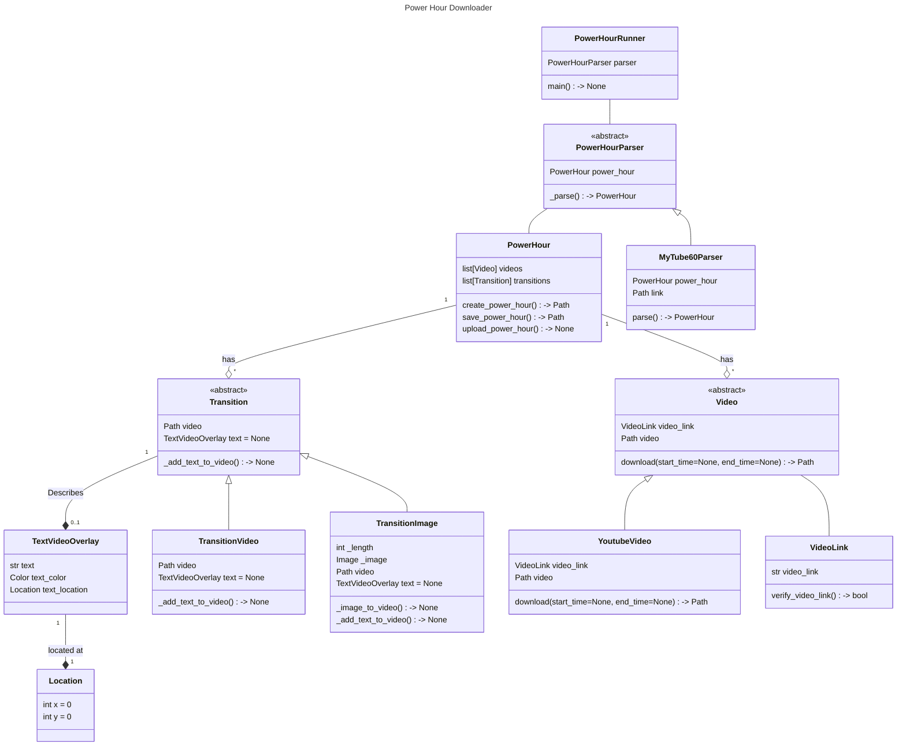

```mermaid
---
title: Power Hour Downloader
---
%% The details of mermaid classDiagram are found here: https://mermaid.js.org/syntax/classDiagram.html
classDiagram
    PowerHourRunner -- PowerHourParser
    class PowerHourRunner {
        PowerHourParser parser

        main() -> None
    }

    PowerHour "1" --o "*" Video: has
    PowerHour "1" --o "*" Transition: has
    class PowerHour {
        list[Video] videos
        list[Transition] transitions

        create_power_hour() -> Path
        save_power_hour() -> Path
        upload_power_hour() -> None
    }

    PowerHourParser -- PowerHour
    class PowerHourParser {
        <<abstract>>
        PowerHour power_hour

        _parse() -> PowerHour
    }

    PowerHourParser <|-- MyTube60Parser
    class MyTube60Parser {
        PowerHour power_hour
        Path link

        parse() -> PowerHour
    }

    class Location {
        %% Coordinates for where TextOverlay will be placed
        %% Default should be the center of the screen
        int x = 0
        int y = 0
    }


    TextVideoOverlay "1" --* "1" Location : located at
    class TextVideoOverlay {
        str text
        Color text_color
        Location text_location
    }

    Transition "1" --* "0..1" TextVideoOverlay : Describes
    class Transition {
        <<abstract>>
        Path video
        TextVideoOverlay text = None

        _add_text_to_video() -> None
    }

    Transition <|-- TransitionVideo
    class TransitionVideo {
        Path video
        TextVideoOverlay text = None

        _add_text_to_video() -> None
    }

    Transition <|-- TransitionImage
    class TransitionImage {
        int _length
        Image _image
        Path video
        TextVideoOverlay text = None

        _image_to_video() -> None
        _add_text_to_video() -> None
    }

    class Video{
        <<abstract>>
        VideoLink video_link
        Path video

        download(start_time=None, end_time=None) -> Path
    }

    Video <|-- YoutubeVideo
    class YoutubeVideo {
        VideoLink video_link
        Path video

        download(start_time=None, end_time=None) -> Path
    }

    Video -- VideoLink
    class VideoLink {
        str video_link

        verify_video_link() -> bool
    }
```
